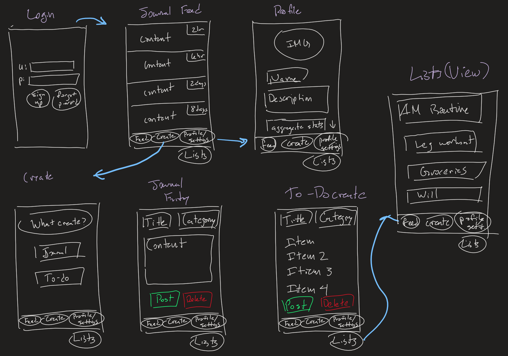

# group-project

Team Members: Lyn Li, Mitchell Massie, Xingguo Huang

Unit 8: Group Milestone - README Example
===

:::info
**Below is an example** of what your **Group Project README** should include and how it should be structured for the **Unit 8 Group Milestone Submission**.
:::

# TURNIN

## Table of Contents
1. [Overview](#Overview)
2. [Product Spec](#Product-Spec)
3. [Wireframes](#Wireframes)

## Overview
### Description
Tracks various daily activities and journaling and organizational tools, and populates a personal feed that is displayed to and reviewable by the user. Allows users to create custom journal entries, reminders, and data tracking entries and categorizes them. Designed for individual use, with potential for social-media style feeds of information users want to make public.

### App Evaluation
- **Category:** Organization / Productivity
- **Mobile:** This app would be primarily developed for mobile but would perhaps be just as viable on a computer. Functionality wouldn't be limited to mobile devices, however mobile version could potentially have more features.
- **Story:** Allows for dynamic journaling and tracking of categorical to-do lists, and for users to create and update personal reminders in one location for a streamlined user experience.
- **Market:** Any individual could choose to use this app, presumably those who are organization and productivity minded, like professionals, students, etc.
- **Habit:** This app would presumably be used daily as a means of tracking adherence to personal goals.
- **Scope:** First we would start with getting users familiarized with having their own centralized productivity resource, and then it could be expanded to a news-feed style application with public facing profiles, or some research-based application that could help identify areas that individuals are struggling to reach their ideal productivity or outcomes, and notify users of potentially helpful resources or modified goals.

## Product Spec
### 1. User Stories (Required and Optional)

**Required Must-have Stories**

* User logs in to access previous journal entries, reminders, and other tracked data entry.
* User loads in to default news-feed of their own recent journal entries (prompts for new entry if none in storage.)
* Ability to create new journal entry
* Ability to create a new categorical to-do list (daily, weekly, morning routine, etc) with complete/incomplete data tracking
* Profile pages for each user
* Settings (Accesibility, Notification, General, etc.)

**Optional Nice-to-have Stories**

* Ability to create a new image entry (alternative to writing in-app)
* Ability to generate successful completion statistics for different to-do lists activities (e.g. flossed in AM, went for morning walk, etc.)
* Ability to create prioritized reminders (if high enough priority, to-do list items will be prompted for through Android notification system)

### 2. Screen Archetypes

* Login 
* Register - User signs up or logs into their account.
   * Upon Download/Reopening of the application, the user is prompted to log in to gain access to their profile information. 
* Journal feed - User logs in successfully and lands here, or navigates here.
   * Most-recently created order of journal entries.
   * Default landing page of application post login, and will prompt user for posts if none in memory.
* Profile Screen - User can access information about their personal account
   * Allows user to upload a photo and fill in information that is interesting to them.
* Journal entry screen - Creating a new journal entry.
   * User can enter text for a new joural entry, and assign a category to it.
* To-do list screen - Creating a new to-do list.
   * User can create a new to-do list, full or a number of trackable items.
   * System will track whether item was successfully completed, and aggregate these results over time. 
* Settings Screen
   * Lets people change language, and app notification settings.

### 3. Navigation

**Tab Navigation** (Tab to Screen)

* Journal Feed
* Creation screen (journal entry, to-do list, etc. options available here)
* Profile
* Settings

**Flow Navigation** (Screen to Screen)
* Forced Log-in -> Account creation if no log in is available
* Journal feed -> Prompts new accounts for new journal entry
* Profile -> Text field to be modified. 
* Settings -> Toggle settings

## Wireframes
<br>

### [BONUS] Digital Wireframes & Mockups


### [BONUS] Interactive Prototype


## Schema 
### Models

#### User
   | Property      | Type     | Description |
   | ------------- | -------- | ------------|
   | objectId      | String   | unique id for the user post (default field) |
   | emailVerified | Boolean  | whether the user is verified or not |
   | ACL           | File     | user permissions |
   | authData      | Number   | authorization data |
   | username      | Number   | user's name/handle |
   | createdAt     | DateTime | date when user is created (default field) |
   | updatedAt     | DateTime | date when user is last updated (default field) |
   | password 	   | String   | The user's hashed password |
   | email	   | String   | User's email |
   | profilePicture | File    | [optional] profile image |
   
#### Post
   | Property      | Type     | Description |
   | ------------- | -------- | ------------|
   | objectId      | String   | unique id for the post (default field) |
   | user	   | Pointer<User> | user the post is created by |
   | category      | String   | post category |
   | title         | String   | post title |
   | description   | String   | written description of image, text/journal, or note content |
   | image         | File     | [optional] image associated with post |
   | createdAt     | DateTime | date when post is created (default field) |
   | updatedAt     | DateTime | date when post is last updated (default field) |
   
#### List
   | Property      | Type     | Description |
   | ------------- | -------- | ------------|
   | objectId      | String   | unique id for the list (default field) |
   | user	   | Pointer<User> | user the list is created by |
   | category      | String   | list category |
   | title         | String   | list title |
   | description   | String   | written description of the purpose of the list |
   | createdAt     | DateTime | date when list is created (default field) |
   | updatedAt     | DateTime | date when list is last updated (default field) |
   | completed	   | boolean  | whether the list is empty or not
	
#### List Item
   | Property      | Type     | Description |
   | ------------- | -------- | ------------|
   | objectId      | String   | unique id for the list item (default field) |
   | user	   | Pointer<User> | user the list item is created by |
   | list	   | Pointer<List> | list that the list item belongs to |
   | category      | String   | list item category |
   | description   | String   | written description of the purpose of the list item |
   | createdAt     | DateTime | date when list item was created (default field) |
   | updatedAt     | DateTime | date when list item was last updated (default field) |
   | completed	   | boolean  | whether the list item was completed successfully |
   | totalCompleted | integer | total number of times the list item has been completed |
	
#### Reminder
   | Property      | Type     | Description |
   | ------------- | -------- | ------------|
   | objectId      | String   | unique id for the reminder (default field) |
   | user	   | Pointer<User> | user the reminder is created by |
   | category      | String   | reminder category |
   | title         | String   | reminder title |
   | description   | String   | written description of the purpose of the reminder |
   | createdAt     | DateTime | date when reminder is created (default field) |
   | updatedAt     | DateTime | date when reminder is last updated (default field) |
   | completed	   | boolean  | whether the reminder is empty or not |
   | ignored	   | boolean  | whether the reminder was ignoed or not |
   | remindAt	   | DateTime | when the next reminder should trigger |
   | listItem      | Pointer<ListItem> | [optional] reference to the list item that this reminder is in relation to |
   | isActive      | boolean  | whether the reminder is active or not |
   | frequency     | integer  | how often the reminder should occur |
   | activeDays    | List<String> | what days the reminder should occur on weekly basis |

### Networking
#### List of network requests by screen
  - Home Feed Screen 
    - (Read/GET) Query all posts where user is author
    	```swift
         let query = PFQuery(className:"Post")
         query.whereKey("objectId", equalTo: currentUser)
         query.order(byDescending: "createdAt")
         query.findObjectsInBackground { (posts: [PFObject]?, error: Error?) in
            if let error = error { 
               print(error.localizedDescription)
            } else if let posts = posts {
               print("Successfully retrieved \(posts.count) posts.")
           // TODO: Do something with posts...
            }
         } 
     	```
		- (Create/POST) Create a new like on a post
		- (Update/PUT) Update an entry's title/content/etc.
		- (Delete) Delete existing entry
	- Create Entry Screen
		- (Create/POST) Create a new entry
	- Create To-do List Screen
		- (Create/POST) Create a new to-do list
		- (Create/POST) Create a new to-do list item
	- View to-do list screen
		- (Read/GET) query all to-do lists where User is author
		- (Read/GET) query all to-do list items belonging to each List
		- (Create/POST) Create a new to-do list item
		- (Update/PUT) update an existing to-do list with new item
		- (Update/PUT) update an existing to-do list item
		- (Delete) Delete existing to-do list
		- (Delete) Delete existing to-do list item
	- Create Reminder Screen
		- (Create/POST) Create a new reminder
	- View reminders screen
		- (Read/GET) query all reminders where User is author
	- Statistics Screen
		- (Read/GET) query stats for the selected to-do list item or reminder task
	- Profile Screen 
		- (Read/GET) Query logged in user object

#### [OPTIONAL:] Existing API Endpoints
##### N/A

